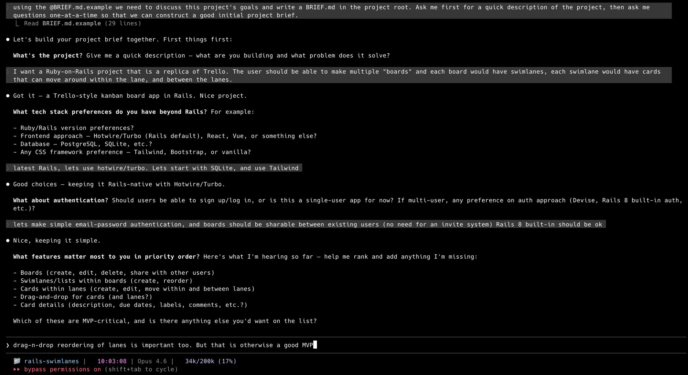

# cc-pipeline

**Autonomous Claude Code pipeline engine.** Install into any repo, write a BRIEF.md describing your project, and let Claude build it phase by phase.

## What Is This?

cc-pipeline orchestrates autonomous development workflows using Claude Code. You provide a project vision in plain language, and the pipeline:

- Breaks down the vision into phases
- Plans and implements each phase
- Runs tests, reviews code, and commits automatically
- Iterates until the project is complete

Think of it as a CI/CD system for AI-driven development—but instead of deploying code, it writes it.

## Prerequisites

- **Node.js** >=18
- **Claude CLI** (`claude`) installed and configured ([get it here](https://docs.claude.ai/docs/claude-cli))
- **tmux** — Required for interactive build/fix steps (Claude runs inside tmux sessions)
  - macOS: `brew install tmux`
  - Ubuntu/Debian: `sudo apt install tmux`
  - Fedora: `sudo dnf install tmux`
- **git** — For the commit step (you probably already have this)

## Installation

Initialize the pipeline in your project:

```bash
cd your-project
npx cc-pipeline@latest init
```

This scaffolds the `.pipeline/` directory, prompt templates, `CLAUDE.md`, and a `BRIEF.md.example` into your project.

## Quick Start

### 1. Initialize the pipeline

```bash
cd your-project
npx cc-pipeline@latest init
```

### 2. Write your project brief

Copy the example and edit it:

```bash
cp BRIEF.md.example BRIEF.md
```

Or let Claude Code help you write it — fire up `claude` in your project and ask:

```
Using the @BRIEF.md.example as a template, let's discuss this project's goals
and write a BRIEF.md. Ask me for a quick description first, then ask questions
one-at-a-time to build a good brief.
```



### 3. Run the pipeline

> **⚠️ Run from a regular terminal, not from inside Claude Code.** The pipeline spawns its own Claude Code sessions in tmux, so running it from within Claude Code would nest sessions — which isn't supported.

```bash
npx cc-pipeline run
```

That's it. The pipeline will spec, build, review, fix, and commit each phase automatically.

### 4. Monitor progress

```bash
npx cc-pipeline status
```

The pipeline also generates a `STATUS.md` at the project root after each phase — a running summary of what's been built, review findings, test coverage, and what's next.

## Commands

| Command | Description |
|---------|-------------|
| `npx cc-pipeline@latest init` | Scaffold `.pipeline/`, `CLAUDE.md`, and `BRIEF.md.example` |
| `npx cc-pipeline@latest update` | Refresh prompts and docs (preserves your `workflow.yaml`) |
| `npx cc-pipeline run [--phases N] [--model NAME]` | Run the pipeline |
| `npx cc-pipeline status` | Show current phase, step, and recent events |
| `npx cc-pipeline reset` | Clear event log, phase outputs, and STATUS.md |

> **Tip:** Use `@latest` with `init` and `update` to get the newest templates. For `run`, `status`, and `reset`, the cached version is fine.

### Run Options

- `--phases <n>` — Limit to N phases (useful for testing)
- `--model <name>` — Override model for all steps (e.g., `opus`, `sonnet`, `haiku`)

### Examples

```bash
npx cc-pipeline run                  # Run until complete
npx cc-pipeline run --phases 3       # Run just 3 phases
npx cc-pipeline run --model opus     # Use opus for all steps
npx cc-pipeline reset                # Start over from scratch
```

The pipeline resumes from interruptions automatically. Press **Ctrl-C** to pause, then `npx cc-pipeline run` again to continue.

## How It Works

### Phases

The pipeline works in **phases**, each representing a unit of progress (e.g., "user authentication", "payment integration"). Each phase follows the same workflow of steps.

### Steps

Each phase runs through these steps (defined in `.pipeline/workflow.yaml`):

1. **spec** — Break the project vision into a phase spec
2. **research** — Analyze the current codebase state
3. **plan** — Create an actionable implementation plan
4. **build** — Implement the plan (interactive Claude in tmux)
5. **review** — Staff engineer-level code review
6. **fix** — Address review findings (skipped if none)
7. **reflect** — Look back at progress, plan the next phase
8. **status** — Update `STATUS.md` with build summary, test coverage, and what's next
9. **commit** — Git commit and push

### Agents

| Agent | How It Runs | Used For |
|-------|------------|----------|
| `claude-piped` | `claude -p "<prompt>"` (non-interactive) | Planning, analysis, reviews, docs |
| `claude-interactive` | Claude in a tmux session with full tool access | Building code, fixing issues |
| `bash` | Direct shell command | Git commits, scripts |

### State & Resume

Pipeline state lives in `.pipeline/pipeline.jsonl` — an append-only event log. The current phase and step are derived from the log, so you can interrupt and resume seamlessly.

### Project Completion

When Claude determines the project is complete, it writes `PROJECT COMPLETE` in `REFLECTIONS.md`. The pipeline stops automatically.

## Configuration

Pipeline behavior is controlled by `.pipeline/workflow.yaml`. See `.pipeline/CLAUDE.md` for full configuration docs — how to edit steps, change agents/models, customize prompts, and add new steps.

### Quick Examples

**Override model per step:**
```yaml
steps:
  - name: spec
    agent: claude-piped
    model: sonnet
    prompt: prompts/spec.md
```

**Add conditional execution:**
```yaml
  - name: fix
    agent: claude-interactive
    prompt: prompts/fix.md
    skip_unless: "MUST-FIX.md"    # Only runs if review produced MUST-FIX.md
```

**Customize prompts:** Edit the markdown files in `.pipeline/prompts/` to change how each step behaves.

## Example BRIEF.md

```markdown
# Project Brief

## Overview
A command-line task manager with persistent storage.

## Tech Stack
- Node.js + SQLite
- No external dependencies

## Features (Priority Order)
1. **Add/list/complete tasks** — Core CRUD operations
2. **Due dates & filtering** — Filter by status, due date
3. **Tags & search** — Organize and find tasks

## Constraints
- Must work offline
- Single-file database

## Testing
- Node test runner for unit tests
- Cover core CRUD operations

## Definition of Done
~3 phases for MVP, complete when all features work with tests passing
```

## Project Structure

After initialization and a few phases:

```
your-project/
├── .pipeline/
│   ├── CLAUDE.md            # Pipeline config docs (for Claude Code)
│   ├── workflow.yaml        # Step definitions, agents, models
│   ├── pipeline.jsonl       # Event log (auto-created on first run)
│   └── prompts/             # Prompt templates (customizable)
│       ├── spec.md
│       ├── research.md
│       ├── plan.md
│       ├── build.md
│       ├── review.md
│       ├── fix.md
│       ├── reflect.md
│       └── status.md
├── docs/
│   └── phases/
│       ├── phase-1/         # Phase artifacts
│       │   ├── SPEC.md
│       │   ├── RESEARCH.md
│       │   ├── PLAN.md
│       │   ├── REVIEW.md
│       │   └── REFLECTIONS.md
│       └── phase-2/
│           └── ...
├── BRIEF.md                 # Your project vision
├── CLAUDE.md                # Project conventions (for Claude Code)
├── AGENTS.md                # Dev docs (created by Phase 1)
├── STATUS.md                # Running build summary (auto-updated)
└── [your code here]
```

## Troubleshooting

**"Claude Code cannot be launched inside another Claude Code session":**
- Run the pipeline from a regular terminal, not from within Claude Code
- If you still see this after exiting Claude Code, run: `unset CLAUDECODE` then try again

**Build step times out (60s+):**
- Check [Anthropic's status page](https://status.anthropic.com) — API issues cause slow startups
- The pipeline will retry on resume: just run `npx cc-pipeline run` again

**Pipeline won't start:**
- Ensure `claude` CLI is installed: `claude --version`
- Ensure `tmux` is installed: `tmux -V`
- Run `npx cc-pipeline@latest init` if `.pipeline/` doesn't exist

**Want to start over:**
```bash
npx cc-pipeline reset
npx cc-pipeline run
```

**Want the latest prompts without losing your workflow.yaml:**
```bash
npx cc-pipeline@latest update
```

## Development

```bash
git clone https://github.com/timothyjoh/cc-pipeline.git
cd cc-pipeline
npm install
npm test
npm link    # For local development
```

## License

MIT License — see [LICENSE](LICENSE) for details.

## Contributing

Contributions welcome! Please open an issue or PR on GitHub.

---

Built with [Claude Code](https://docs.claude.ai/docs/claude-cli) by Anthropic.
