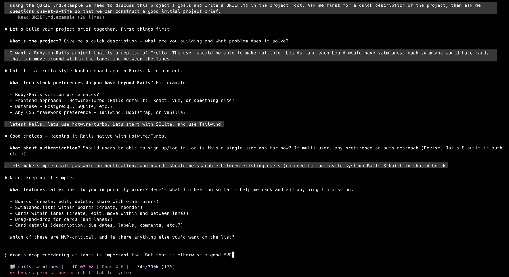

# cc-pipeline

**Autonomous Claude Code pipeline engine.** Install into any repo, write a BRIEF.md describing your project, and let Claude build it phase by phase.

Read the intro blog post (a week outdated) [https://curiousagents.substack.com/](https://curiousagents.substack.com/p/experiments-in-building-an-automatic)

## What Is This?

cc-pipeline orchestrates autonomous development workflows using Claude Code. You provide a project vision in plain language, and the pipeline:

- Breaks down the vision into phases
- Plans and implements each phase
- Runs tests, reviews code, and commits automatically
- Iterates until the project is complete

Think of it as a CI/CD system for AI-driven development—but instead of deploying code, it writes it.

## Prerequisites

- **Node.js** >=18
- **Claude CLI** (`claude`) installed and configured ([get it here](https://docs.claude.ai/docs/claude-cli))
- **git** — For the commit step (you probably already have this)

## Installation

Initialize the pipeline in your project:

```bash
cd your-project
npx cc-pipeline@latest init
```

This scaffolds the `.pipeline/` directory, prompt templates, `CLAUDE.md`, and a `BRIEF.md.example` into your project.

## Quick Start

### 1. Initialize the pipeline

```bash
cd your-project
npx cc-pipeline@latest init
```

### 2. Write your project brief

Copy the example and edit it:

```bash
cp BRIEF.md.example BRIEF.md
```

Or let Claude Code help you write it — fire up `claude` in your project and ask:

```
Using the @BRIEF.md.example as a template, let's discuss this project's goals
and write a BRIEF.md. Ask me for a quick description first, then ask questions
one-at-a-time to build a good brief.
```



### 3. Run the pipeline

```bash
npx cc-pipeline run
```

The TUI launches automatically in a terminal, showing live step progress, agent activity, and per-step timers. That's it — the pipeline will spec, build, review, fix, and commit each phase automatically.

## Commands

| Command | Description |
|---------|-------------|
| `npx cc-pipeline@latest init` | Scaffold `.pipeline/`, `CLAUDE.md`, and `BRIEF.md.example` |
| `npx cc-pipeline@latest update` | Refresh prompts and docs (preserves your `workflow.yaml`) |
| `npx cc-pipeline run [options]` | Run the pipeline |
| `npx cc-pipeline status` | Show current phase, step, and recent events |
| `npx cc-pipeline reset` | Clear event log, phase outputs, and STATUS.md |

> **Tip:** Use `@latest` with `init` and `update` to get the newest templates. For `run`, `status`, and `reset`, the cached version is fine.

### Run Options

- `--phases <n>` — Limit to N phases (useful for testing)
- `--model <name>` — Override model for all steps (e.g., `opus`, `sonnet`, `haiku`)
- `--ui` — Force TUI on (default: auto-detects TTY)
- `--no-ui` — Plain log output, no TUI (useful for CI/pipes)

### Examples

```bash
npx cc-pipeline run                  # Run until complete (TUI auto-enabled)
npx cc-pipeline run --phases 3       # Run just 3 phases
npx cc-pipeline run --model opus     # Use opus for all steps
npx cc-pipeline run --no-ui          # Plain output, no TUI
npx cc-pipeline reset                # Start over from scratch
```

The pipeline resumes from interruptions automatically. Press **Ctrl-C** to pause, then `npx cc-pipeline run` again to continue.

## How It Works

### Phases

The pipeline works in **phases**, each representing a unit of progress (e.g., "user authentication", "payment integration"). Each phase follows the same workflow of steps.

### Epics

The pipeline organizes work into **Epics** — vertical slices of user-testable value stored in `docs/epics/`. Each Epic represents a real capability a user can open, see, and evaluate (e.g., "User can sign up and log in", not "Set up the database").

The `groom` step manages Epics automatically: bootstrapping them from your `BRIEF.md` on phase 1, transitioning to the next Epic when one is complete, and skipping when work is already in progress.

### Steps

Each phase runs through these steps (defined in `.pipeline/workflow.yaml`):

1. **groom** — Bootstrap Epics from `BRIEF.md` (phase 1), transition to next Epic, or skip if current Epic is in-progress
2. **spec** — Break the current Epic into a phase spec
3. **research** — Analyze the current codebase state
4. **plan** — Create an actionable implementation plan
5. **build** — Implement the plan
6. **review** — Staff engineer-level code review
7. **fix** — Address review findings (skipped if none)
8. **reflect** — Look back at what happened this phase; update the Epic's remaining work
9. **next** — Write a short `NEXT.md` steering pointer (which Epic, in-progress or complete)
10. **status** — Update `STATUS.md` with build summary, test coverage, and what's next
11. **commit** — Git commit and push

### Agents

| Agent | How It Runs | Used For |
|-------|------------|----------|
| `claudecode` | Claude Agent SDK (in-process) | All AI steps by default |
| `codex` | OpenAI Codex CLI (`codex exec --yolo`) | Alternative for build/fix |
| `bash` | Direct shell command | Scripts, git operations |

### State & Resume

Pipeline state lives in `.pipeline/pipeline.jsonl` — an append-only event log. The current phase and step are derived from the log, so you can interrupt and resume seamlessly.

### Project Completion

When all Epics are finished, the `groom` step writes `PROJECT COMPLETE` in `GROOM.md`. The pipeline stops automatically.

### Continuing Development Beyond the Initial Brief

Epics are the primary way to extend a project after the initial build. Your `BRIEF.md` is immutable — it's the original vision — but you can keep adding Epics to `docs/epics/` indefinitely.

**To add a new Epic**, create a file like `docs/epics/epic-4-short-name.md` (increment the number) with just a Goal and Acceptance Criteria:

```markdown
# Epic 4: [Short descriptive name]

## Goal
What the user can do when this Epic is complete. Must be something
a user can open, see, and evaluate — not an infrastructure task.

## Acceptance Criteria
- [ ] Observable thing a user can do or see
- [ ] Another testable outcome
```

The `groom` step will handle research and planning detail — you only need to express intent. Once the file exists, run `npx cc-pipeline run` and it picks up from there.

**Good Epics** are vertical slices of user-testable value:
- ✅ "User can filter and search results"
- ✅ "Admin can export data as CSV"
- ❌ "Refactor the API layer" (infrastructure, not user-visible)

You can also ask Claude Code to help write the next Epic based on what's already been built:
```
Look at docs/epics/ and STATUS.md, then help me write the next Epic.
```

## Configuration

Pipeline behavior is controlled by `.pipeline/workflow.yaml`. See `.pipeline/CLAUDE.md` for full configuration docs — how to edit steps, change agents/models, customize prompts, and add new steps.

### Quick Examples

**Override model per step:**
```yaml
steps:
  - name: build
    agent: claudecode
    model: claude-opus-4-5
    prompt: prompts/build.md
```

**Use Codex for build/fix:**
```yaml
  - name: build
    agent: codex
    model: o4-mini
    prompt: prompts/build.md
```

**Add conditional execution:**
```yaml
  - name: fix
    agent: claudecode
    prompt: prompts/fix.md
    skip_unless: "MUST-FIX.md"    # Only runs if review produced MUST-FIX.md
```

**Set a phase limit (default is 100):**
```yaml
max_phases: 50
```

**Customize prompts:** Edit the markdown files in `.pipeline/prompts/` to change how each step behaves.

## Example BRIEF.md

```markdown
# Project Brief

## Overview
A command-line task manager with persistent storage.

## Tech Stack
- Node.js + SQLite
- No external dependencies

## Features (Priority Order)
1. **Add/list/complete tasks** — Core CRUD operations
2. **Due dates & filtering** — Filter by status, due date
3. **Tags & search** — Organize and find tasks

## Constraints
- Must work offline
- Single-file database

## Testing
- Node test runner for unit tests
- Cover core CRUD operations

## Definition of Done
~3 phases for MVP, complete when all features work with tests passing
```

## Project Structure

After initialization and a few phases:

```
your-project/
├── .pipeline/
│   ├── CLAUDE.md            # Pipeline config docs (for Claude Code)
│   ├── workflow.yaml        # Step definitions, agents, models
│   ├── pipeline.jsonl       # Event log (auto-created on first run)
│   └── prompts/             # Prompt templates (customizable)
│       ├── groom.md
│       ├── spec.md
│       ├── research.md
│       ├── plan.md
│       ├── build.md
│       ├── review.md
│       ├── fix.md
│       ├── reflect.md
│       ├── next.md
│       └── status.md
├── docs/
│   ├── epics/               # Epic definitions (managed by groom step)
│   │   ├── epic-1-auth.md
│   │   └── epic-2-dashboard.md
│   └── phases/
│       ├── phase-1/         # Phase artifacts
│       │   ├── GROOM.md
│       │   ├── SPEC.md
│       │   ├── RESEARCH.md
│       │   ├── PLAN.md
│       │   ├── REVIEW.md
│       │   ├── REFLECTIONS.md
│       │   └── NEXT.md
│       └── phase-2/
│           └── ...
├── BRIEF.md                 # Your project vision
├── CLAUDE.md                # Project conventions (for Claude Code)
├── AGENTS.md                # Dev docs (created by Phase 1)
├── STATUS.md                # Running build summary (auto-updated)
└── [your code here]
```

## Troubleshooting

**Pipeline won't start:**
- Ensure `claude` CLI is installed: `claude --version`
- Run `npx cc-pipeline@latest init` if `.pipeline/` doesn't exist

**Step times out or hangs:**
- Check [Anthropic's status page](https://status.anthropic.com) — API issues cause slow startups
- The pipeline resumes automatically: press Ctrl-C and run `npx cc-pipeline run` again
- For codex steps, an inactivity timeout (5 min of no output) will automatically retry up to 3 times

**Want to start over:**
```bash
npx cc-pipeline reset
npx cc-pipeline run
```

**Want the latest prompts without losing your workflow.yaml:**
```bash
npx cc-pipeline@latest update
```

## Development

```bash
git clone https://github.com/timothyjoh/cc-pipeline.git
cd cc-pipeline
npm install
npm test
npm link    # For local development
```

## License

MIT License — see [LICENSE](LICENSE) for details.

## Contributing

Contributions welcome! Please open an issue or PR on GitHub.

---

Built with [Claude Code](https://docs.claude.ai/docs/claude-cli) by Anthropic.
